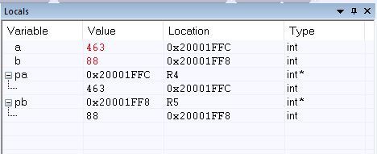

## Assignment 5 Answers

1a. main() creates two variable objects for the values to be swapped. Then it creates two objects of type pointer and assigns them the addresses of the variable objects.

1b. R0 = 0x20001ffc, R1 = 0x20001ff8 

1c. The local variables:

2 & 3. I could not solve the link error and get it to run. My assembler code is uploaded.
